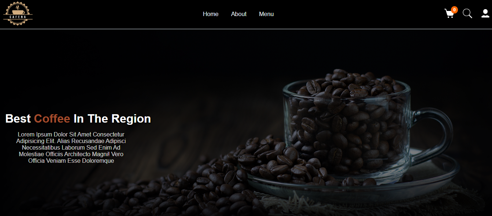
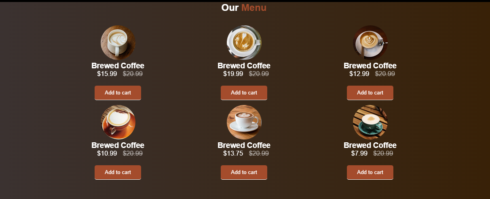

# Coffee-Project

esse mini site foi feito usando: html, css e JavaScript  
por enquanto ele terá funções basicas para que futuramente eu possa dar um upgrade nele.

## ferramentas usadas

html  
css  
javascript

# preview

parte inicial  

sobre  

produtos  
